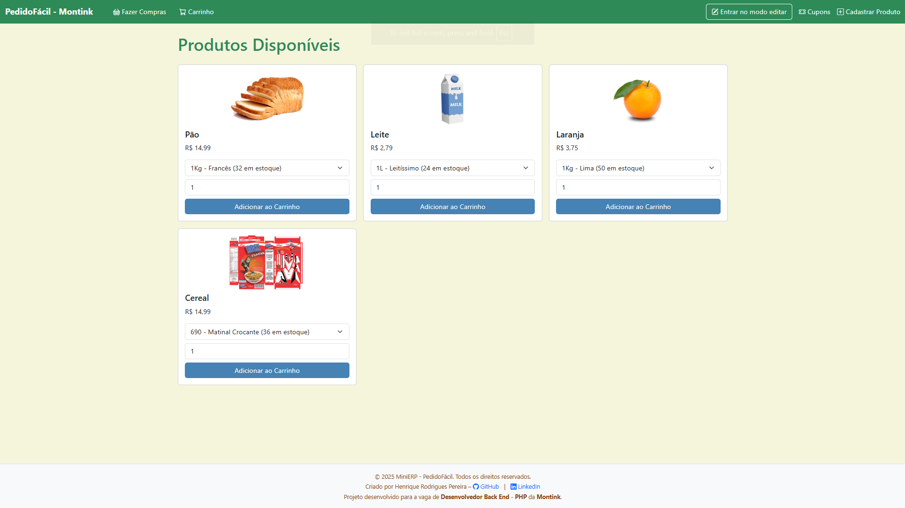
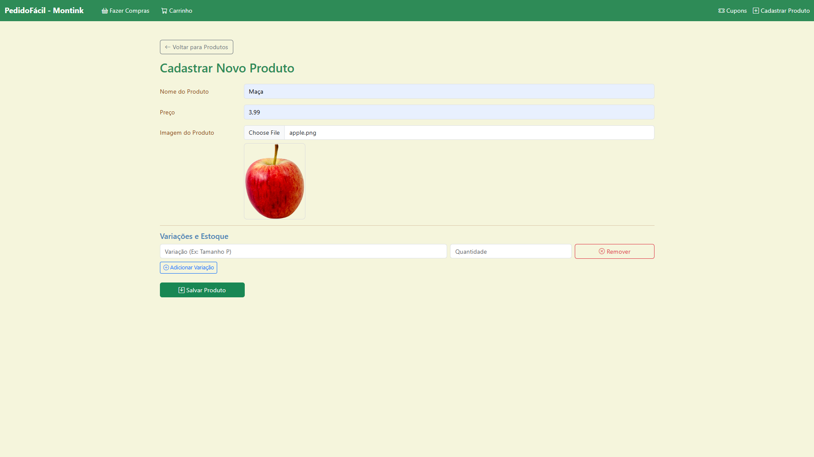
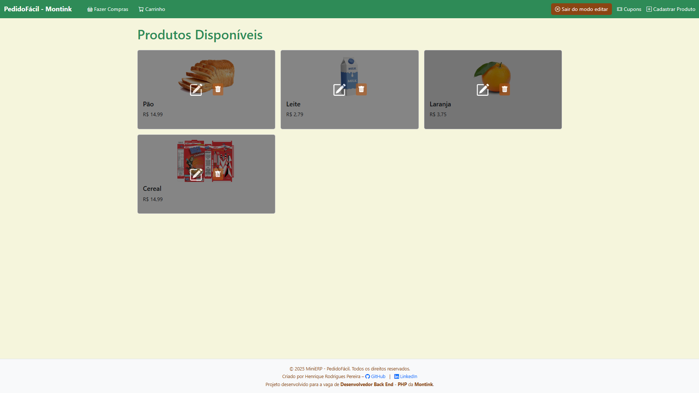
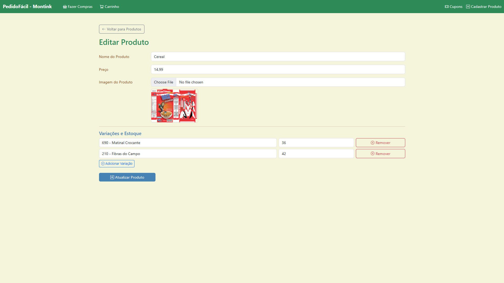
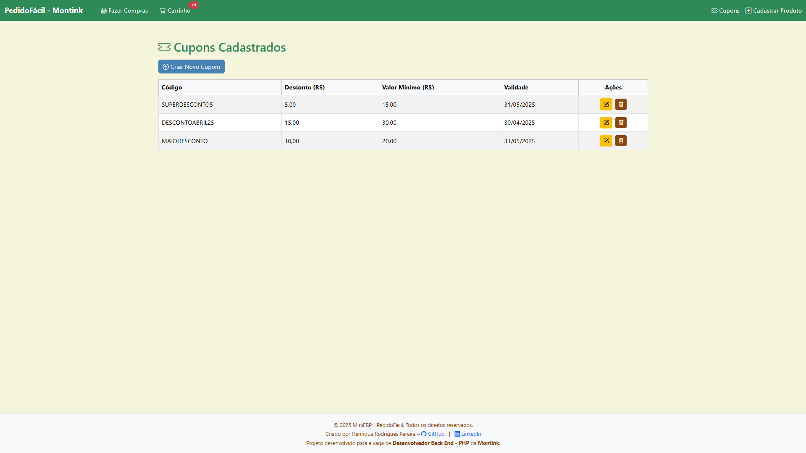
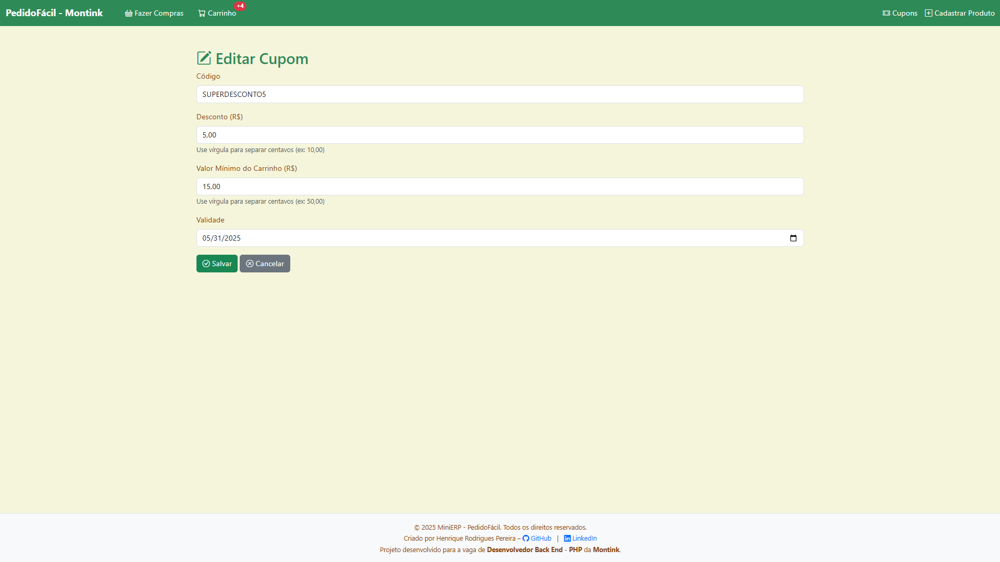
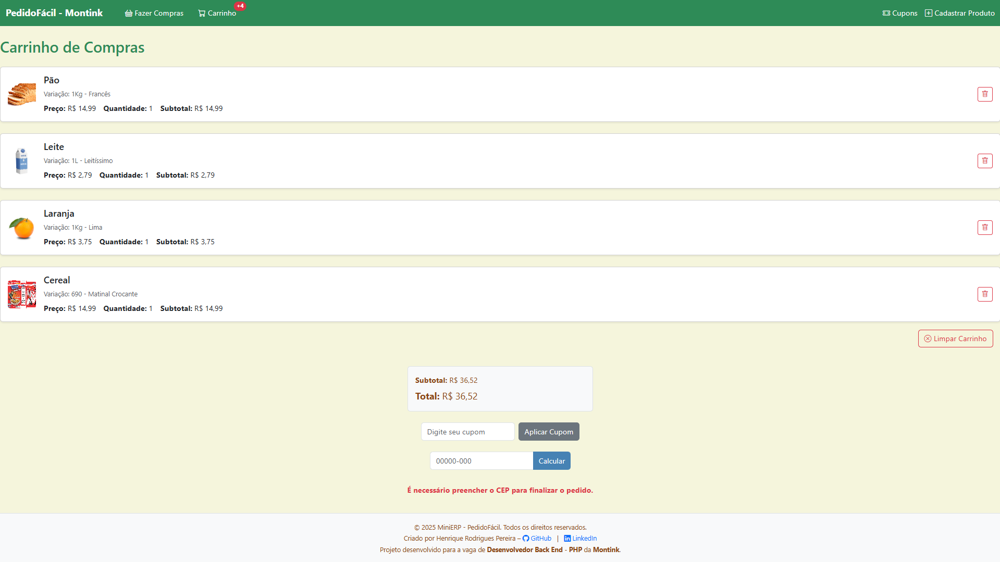
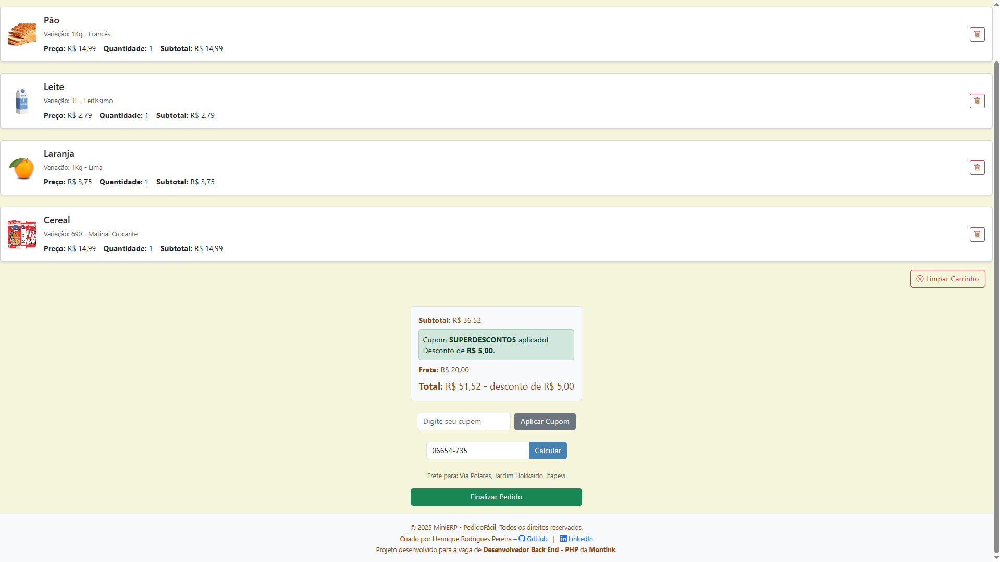

# MiniERP-PedidoFacil-Montink

> **Projeto desenvolvido como teste técnico para a vaga de Desenvolvedor Back End - PHP na Montink**, startup líder em Print on Demand.  
> Este mini sistema ERP foi criado para demonstrar habilidades em PHP, CodeIgniter, arquitetura MVC e boas práticas de desenvolvimento.

Mini sistema ERP para gerenciamento de produtos, cupons, estoque e pedidos com frete inteligente. Desenvolvido como teste técnico em PHP com CodeIgniter, seguindo boas práticas e arquitetura MVC.

---

## ✅ Funcionalidades Implementadas

- Cadastro de produtos com:
  - Nome, Preço, Imagem
  - Controle de Variações (tamanhos, cores, etc.)
  - Estoque por variação (bônus)
- Atualização de produtos e estoque
- Carrinho de compras com sessão
- Cálculo automático de subtotal, frete e total:
  - R$52,00 a R$166,59 → R$15,00
  - Acima de R$200,00 → Frete Grátis
  - Outros valores → R$20,00
- Aplicação de cupons com regras de valor mínimo e validade
- Consulta de CEP via API externa ([https://viacep.com.br](https://viacep.com.br))
- Código limpo, simples, seguindo padrão MVC

---

## ❌ Funcionalidades Não Implementadas

- Envio de e-mail ao finalizar o pedido
- Webhook de atualização/cancelamento de pedidos


## 🧱 Banco de Dados (MySQL)

```sql
-- Create database
CREATE DATABASE IF NOT EXISTS mini_erp DEFAULT CHARACTER SET utf8mb4 COLLATE utf8mb4_general_ci;
USE mini_erp;

-- Table: products
CREATE TABLE products (
    id INT AUTO_INCREMENT PRIMARY KEY,
    name VARCHAR(255) NOT NULL,
    price DECIMAL(10,2) NOT NULL,
    image_path VARCHAR(255), -- Caminho da imagem do produto
    created_at TIMESTAMP DEFAULT CURRENT_TIMESTAMP
);

-- Table: stock
CREATE TABLE stock (
    id INT AUTO_INCREMENT PRIMARY KEY,
    product_id INT,
    variation VARCHAR(255),
    quantity INT DEFAULT 0,
    FOREIGN KEY (product_id) REFERENCES products(id) ON DELETE CASCADE
);

-- Table: orders
CREATE TABLE orders (
    id INT AUTO_INCREMENT PRIMARY KEY,
    total DECIMAL(10,2),
    shipping DECIMAL(10,2),
    status ENUM('pending', 'paid', 'cancelled') DEFAULT 'pending',
    zip_code VARCHAR(9),
    address TEXT,
    created_at TIMESTAMP DEFAULT CURRENT_TIMESTAMP
);

-- Table: coupons
CREATE TABLE coupons (
    id INT AUTO_INCREMENT PRIMARY KEY,
    code VARCHAR(50) UNIQUE NOT NULL,
    discount DECIMAL(10,2),
    min_value DECIMAL(10,2),
    valid_until DATE
);
```

## ⚙️ Como Executar o Projeto
```bash
# Clone o repositório
git clone https://github.com/seu-usuario/MiniERP-PedidoFacil-Montink.git

# Configure seu ambiente local (Apache + PHP + MySQL)
# Exemplo com XAMPP: coloque o projeto na pasta htdocs/

# Crie o banco e execute o SQL acima:
# - Acesse seu gerenciador MySQL (phpMyAdmin, MySQL Workbench, CLI)
# - Execute o script SQL para criar banco e tabelas

# Configure a conexão com o banco em application/config/database.php

# Inicie o servidor web e acesse:
http://localhost/MiniERP-PedidoFacil-Montink/index.php/products
```

## 📌 Considerações
- Interface simples, responsiva e clara

- Foco em organização, manutenção e clareza do código

- Validações e feedbacks amigáveis

- Ideal para simulação de fluxo básico de e-commerce

---

## 🖼️ Capturas de Tela do Projeto

### Página Inicial


### Cadastro de Produtos (Visão Geral)


### Edição de Produto (Parte 1)


### Edição de Produto (Parte 2)


### Página de Cupons (Visão Geral)


### Edição e Criação de Cupons (Visão Geral)


### Carrinho de Compras


### Carrinho de Compras com Cupom e Frete


---

## 🚀 Entrega
O projeto está hospedado neste repositório público. O código SQL para criação do banco está incluso acima neste README.md.


## Autor
👤 [Henrique Rodrigues - LinkedIn](https://www.linkedin.com/in/henriquerodrigues-dev/)  